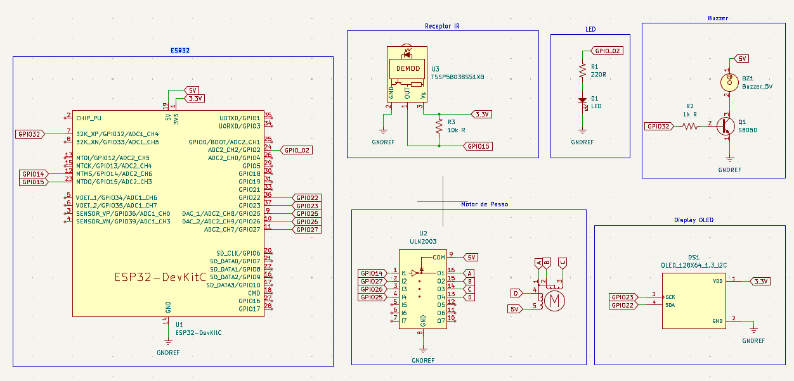

<p align="left">
  
  
  
  
</p>

# Microondas Inteligente
O projeto foi desenvolvido com foco em estudar arquitetura de firmware e documentação. A ideia é o Dev que vós fala aprimorar seus conhecimentos em Firmware e arquitetura de sistemas e também em como documentar da melhor forma para que outros possam aprender com este exemplo. Então fiquem a vontade para testarem e entrar em contato para sugestões de melhorias da documentação ou do projeto em si, meus contatos estão disponivéis no meu perfil. =)

## Descrição
Sistema de microondas simulado utilizando ESP32 com FreeRTOS, controle remoto infravermelho (protocolo NEC) e display OLED. O usuário digita o tempo de aquecimento pelos botões numéricos do controle no formato **MM:SS**, inicia com o botão **PLAY**, e acompanha a contagem regressiva na tela. O LED serve para simular que o microondas está esquentando e o motor para o prato girando. Ao término, o motor para e um buzzer avisa que o aquecimento acabou.

## Componentes
| Componente | Quantidade |
|---|---:|
| ESP32 DevKit | 1 |
| Receptor IR (protocolo NEC) | 1 |
| Controle remoto IR genérico | 1 |
| Motor de passo 28BYJ-48 5V | 1 |
| Driver ULN2003 | 1 |
| Display OLED I2C 128x64 (SSD1306) | 1 |
| Buzzer 5V | 1 |
| Transistor S8050 | 1 |
| LED | 1 |
| Protoboard | 1 |
| Resistor 10kΩ | 1 |
| Resistor 1kΩ | 1 |
| Resistor 220Ω | 1 |
| Jumpers | vários |

## Software Utilizado
| Software              | Descrição                          |
|-----------------------|------------------------------------|
| VSCode + PlatformIO   | IDE e build system                 |
| IRremoteESP8266 (crankyoldgit) | Decodificação do protocolo NEC |
| AccelStepper (waspinator) | Controle do motor de passo |
| Adafruit SSD1306 + GFX | Biblioteca do display OLED |
| FreeRTOS | Sistema operacional de tempo real |

## Arquitetura do Projeto
O firmware é dividido em camadas, é a primeira vez que faço esse formato desacoplado para que o código fique mais profissional, a ideia é cada bloco ter responsabilidade única, isso facilita manutenção e permite trocar um componente sem afetar o resto do código:


```
src/
├── config.h              # pinos e constantes do projeto
├── estado.h              # struct compartilhado + mutex
├── main.cpp              # inicialização e criação das tasks
├── drivers/              # Cada componente tem seus próprios arquivos de funções e configurações
│   ├── controle.h            
│   ├── motor.h / motor.cpp
│   ├── display.h / display.cpp
│   ├── relogio.h / relogio.cpp
│   └── buzzer.h / buzzer.cpp
└── tasks/                    # Tasks do FreeRTOS
    ├── task_controle.cpp
    ├── task_motor.cpp
    └── task_tela.cpp
```

Três tasks rodam em paralelo: `task_controle` lê o sinal IR e escreve no estado, `task_motor` gira o motor e desconta o tempo restante, `task_tela` lê o estado e desenha o display. Nenhuma task chama outra diretamente — toda comunicação passa pelo `estado` compartilhado, protegido por mutex.

## Esquemático
<p align="center">
  
</p>

## Pinagem
| Sinal | Pino ESP32 |
|---|:---:|
| Receptor IR | 15 |
| Motor — IN1 | 14 |
| Motor — IN2 | 27 |
| Motor — IN3 | 26 |
| Motor — IN4 | 25 |
| Display — SDA | 22 |
| Display — SCL | 23 |
| Buzzer | 13 |
| LED | 2 |

## Como Usar
1. Ao ligar, o display exibe o relógio atual.
2. Digite o tempo desejado nos botões numéricos do controle, no formato **MM:SS** (ex: `1`, `3`, `0`, `0` → 13 minutos).
3. Pressione **PLAY** para iniciar o aquecimento — o motor gira, o LED acende e a tela passa a mostrar a contagem regressiva.
4. Pressione **POWER** a qualquer momento para cancelar e voltar ao relógio.
5. Ao zerar o tempo, o motor para, o LED apaga, o buzzer emite três bips, e a tela volta ao relógio automaticamente.

## Resultado
<p align="center">
  
</p>


## Licença
Este projeto está sob a licença MIT — sinta-se livre para usar, modificar e compartilhar.
